# 📚 Biblioteca Aurora API

API REST desenvolvida para gerenciamento de livros e autores, permitindo operações completas de cadastro, consulta, atualização e remoção de dados utilizando Node.js, Express e MySQL.

## 🚀 Tecnologias Utilizadas

* Node.js
* Express.js
* MySQL
* Postman
* Dotenv

---

## 📂 Estrutura do Projeto

```text
biblioteca-aurora/
│
├── controllers/
├── models/
├── routes/
├── config/
├── prints/
├── .env
├── server.js
├── package.json
└── README.md
```

### Estrutura do Projeto

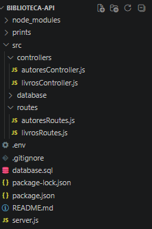

---

## 🗄️ Banco de Dados MySQL

### Criação das Tabelas


### Registros Inseridos


---

## 📖 Testes dos Endpoints de Livros

### GET - Listar Livros

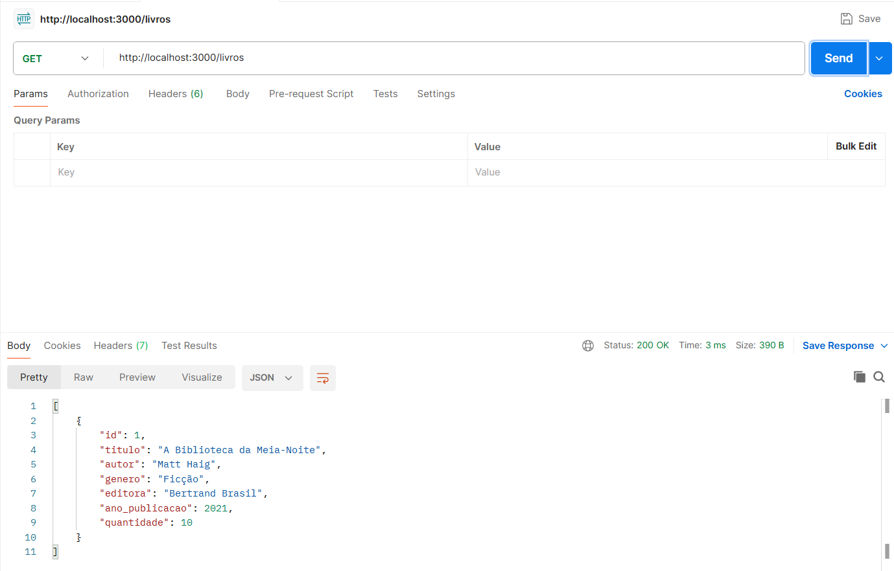

### GET - Buscar Livro por ID

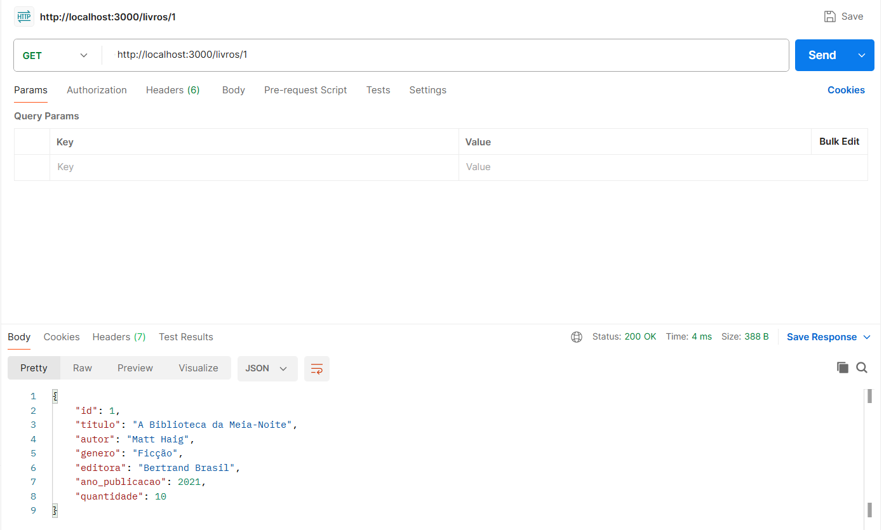

### POST - Cadastrar Livro

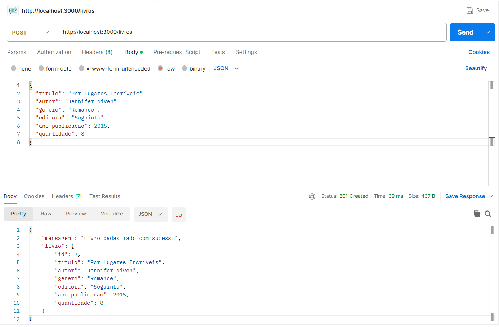

### PUT - Atualizar Livro

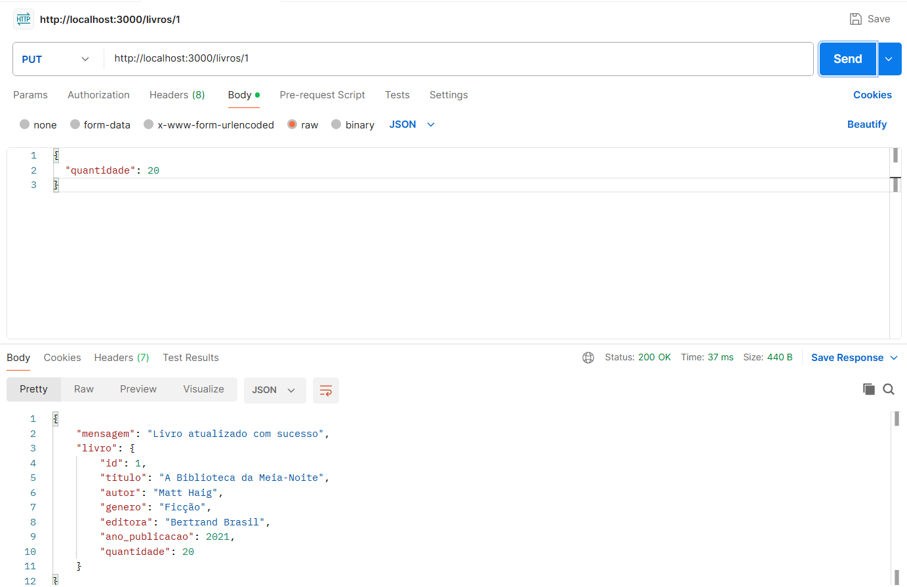

### DELETE - Remover Livro

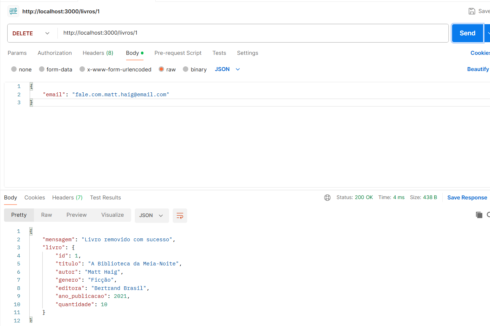

---

## ✍️ Testes dos Endpoints de Autores

### GET - Listar Autores

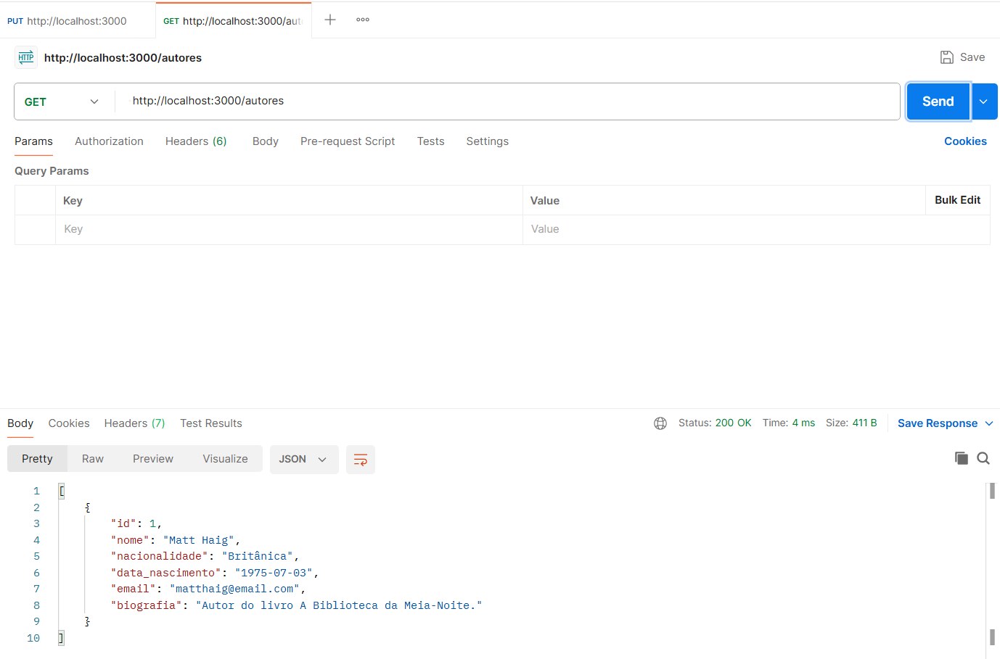

### GET - Buscar Autor por ID

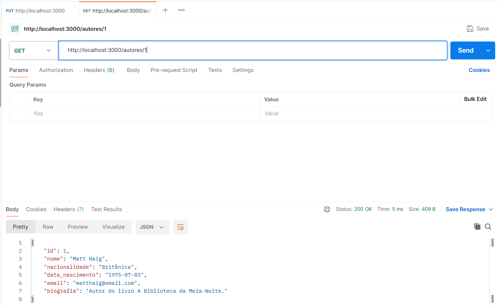

### POST - Cadastrar Autor

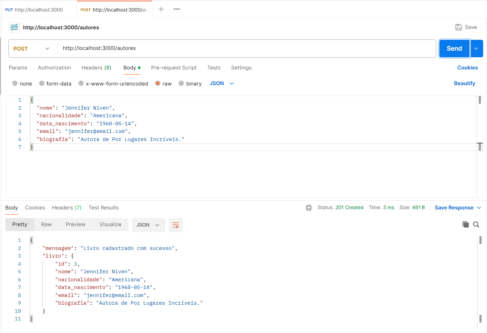

### PUT - Atualizar Autor

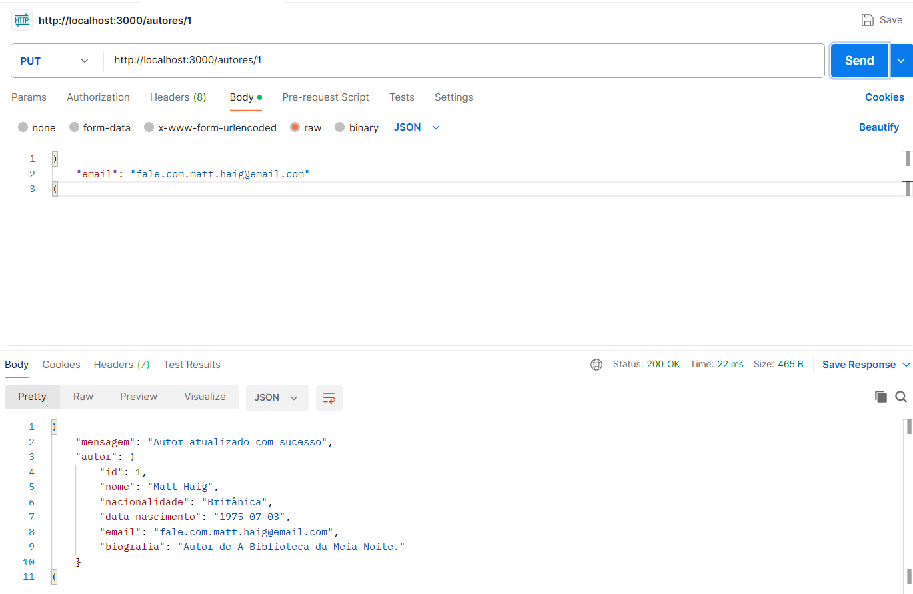

### DELETE - Remover Autor

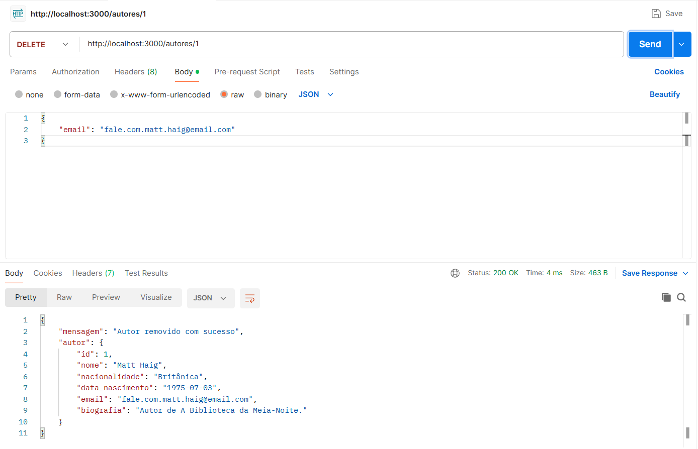

---

## 🔗 Endpoints Disponíveis

### Livros

| Método | Endpoint    |
| ------ | ----------- |
| GET    | /livros     |
| GET    | /livros/:id |
| POST   | /livros     |
| PUT    | /livros/:id |
| DELETE | /livros/:id |

### Autores

| Método | Endpoint     |
| ------ | ------------ |
| GET    | /autores     |
| GET    | /autores/:id |
| POST   | /autores     |
| PUT    | /autores/:id |
| DELETE | /autores/:id |

---

## 👩‍💻 Autora
Trícia Britto
Projeto desenvolvido para a disciplina de Desenvolvimento de APIs – SENAI.